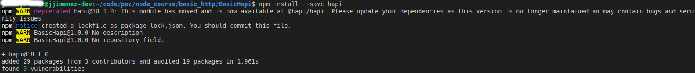
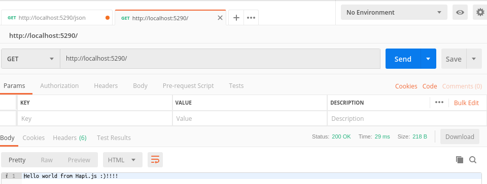
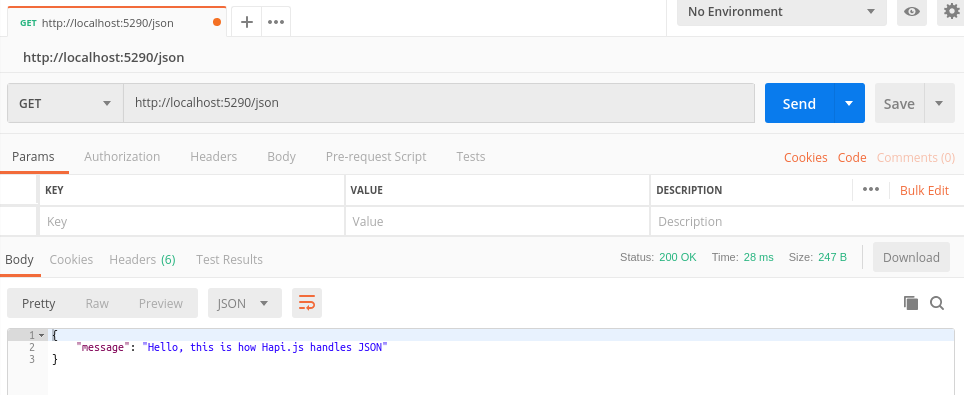

*** npm and Hapi.js usage ***

This project uses npm (from my point of view this is something like pip) and frozen the requeriments into package.json.

Command usage is something like `npm install --save <package_name>`

When the server is running we get something like this:

And we can get string responses and JSON formatted responses easily!
    1. String responses: 
    2. JSON responses: 