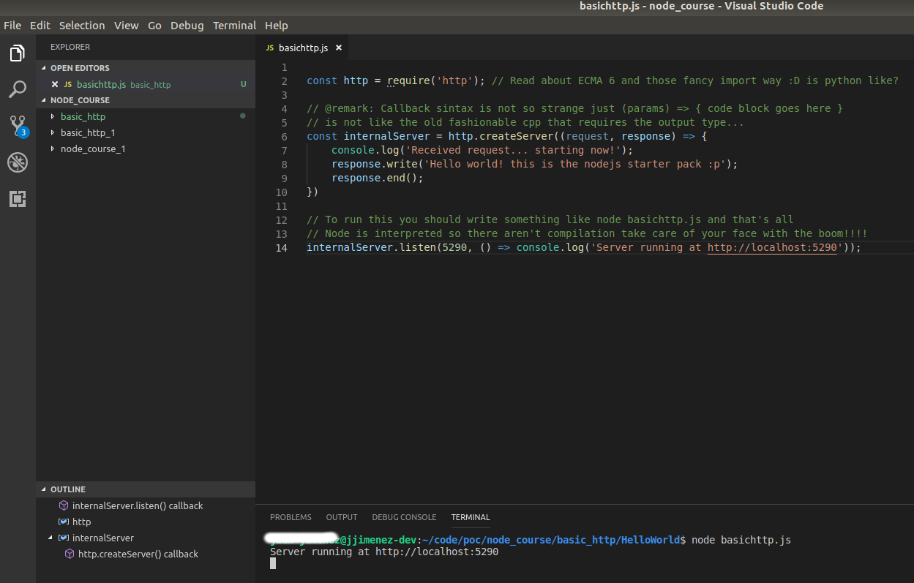
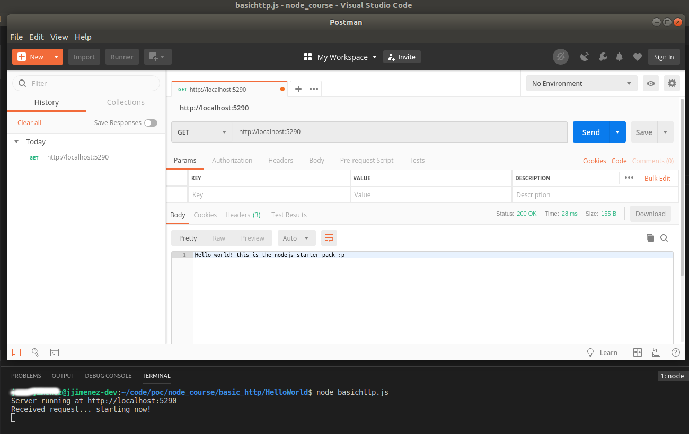

*** This is the hello world example ***

All the comments into the code are made from me looking to get some stuff clearer, take it at your own risk.

#### Results

When the execution starts the server shows up something like:

And when a request arrives:

In this case the request was launched from Postman and the response was received good!