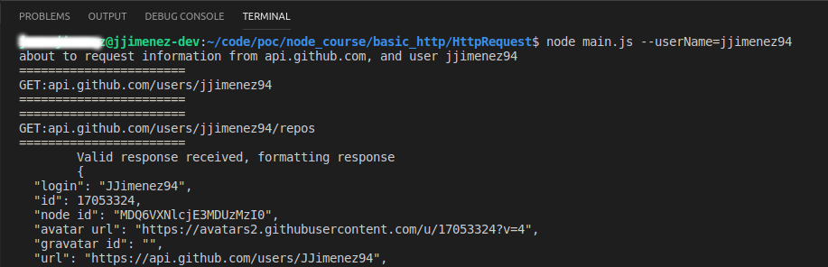

**Basic request and running parameters usage**

This project uses the packages request (for http request handling) and yargs (for input parameters handling) and it's aimed to get some basic user info from a requested github user including the public repos.

The command to run this program is `node main.js --userName=<your github username>` and the output will be something like this:

###### REMARK: The request output is a basic JSON with stringify if you want to put it pretty can do it without any worries.
